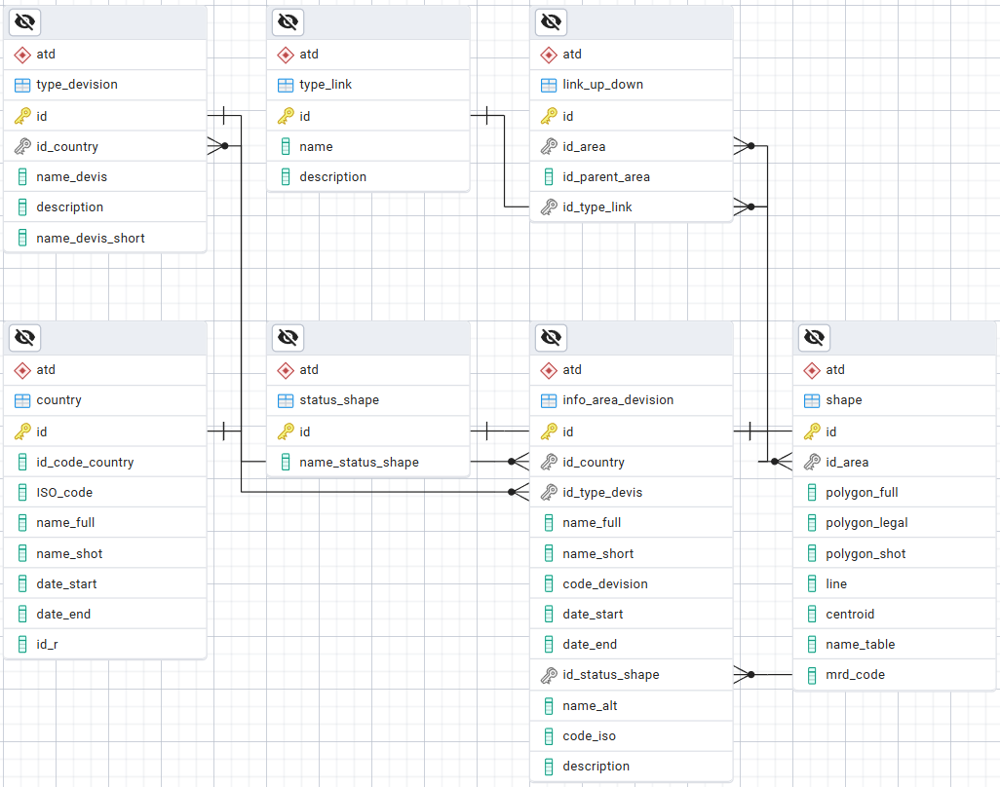

# Загрузка АТД Индии в БД NSI (вер. 1.2)

Инструкция по миграции данных административно-территориального деления (АТД) Республики Индия в базу данных NSI.

## Содержание

- [Назначение](#назначение)
- [Установка PostgreSQL и PostGIS](#установка-postgresql-и-postgis)
- [Восстановление базы NSI](#восстановление-базы-nsi)
- [Исходные данные](#исходные-данные)
- [Схема базы NSI](#схема-базы-nsi)
- [ETL-процесс](#etl-процесс)
- [SQL скрипты](#sql-скрипты)
- [Приложение](#приложение)

***

## Назначение

**Загрузка данных административно-территориального деления Индии в базу данных NSI.**

Процесс охватывает все уровни административной иерархии от штатов до деревень с установкой соответствующих связей между единицами АТД.

***

## Установка PostgreSQL и PostGIS

### Процесс установки
Процесс установки подробно описан в документе `«ФИМ МэТИ – SQL для прикладных задач – Установка Postgre.pdf»`. 

**Рекомендации по установке PostGIS:**
- В **Stack Builder** выберите компоненты: `Spatial Extensions` → `PostGIS` (актуальная версия).
- В разделе **Database Drivers** выберите: `npgsql`, `pgjdbc`, `psqlodbc 64 bit`.
- Обязательно отметьте опцию **«Enable All GDAL Drivers»** для обеспечения поддержки формата `.tif`.

### Ссылка для скачивания
[PostgreSQL Downloads](https://www.enterprisedb.com/downloads/postgres-postgresql-downloads) — официальная страница загрузки.

### Рисунок 1 — Stack Builder установка PostGIS


***

## Восстановление базы NSI

### Описание процесса
Для развертывания структуры необходимо восстановить данные из файла `nsi.dump`. После создания базы данных `nsi` под пользователем `postgres`, выполните активацию расширения:

```sql
-- Активация расширения PostGIS в базе данных PostgreSQL
CREATE EXTENSION postgis;
```

> [!IMPORTANT]
> Восстановление следует выполнять через **Restore** с форматом **Custom or Tar**. В параметрах **Data Options** необходимо включить опции **Do not save Owner** и **Do not save Privileges**.

### Работа с командной строкой

1. **Переход в директорию PostgreSQL:**
   ```bash
   cd "C:\Program Files\PostgreSQL\17\bin"
   ```

2. **Просмотр содержимого дампа:**
   ```bash
   .\pg_restore -l "C:\backup\nsi.dump"
   ```

3. **Создание пользователя и базы:**
   ```bash
   .\psql -U postgres
   -- Внутри psql:
   CREATE ROLE nsi LOGIN PASSWORD 'ваш_пароль';
   \q

   .\createdb -U postgres -E UTF8 nsi
   ```

4. **Запуск восстановления и создание бэкапа:**
   ```bash
   -- Восстановление
   .\pg_restore -U postgres -d nsi -v "C:\backup\nsi.dump"

   -- Резервное копирование после изменений
   .\pg_dump -U postgres -F c -b -v -f "C:\backup\nsi.dump" nsi
   ```

***

## Исходные данные

### Структура и источник
Данные АТД получены из официального реестра **[LGDirectory - Local Government Directory of India](https://lgdirectory.gov.in/)**. 

- **Формат:** SHP (ESRI Shapefile).
- **Система координат:** WGS 84 (`EPSG:4326`).
- **Спецификация:** Соответствует документу «Описание полей векторной БД АТД Индии (версия 1.1)».

### Загрузка в схему public
Загрузка выполняется с помощью утилиты `shp2pgsql`. Флаг `-I` создает пространственный индекс, а `-D` использует формат дампа для ускорения записи.

```bash
cd "C:\Program Files\PostgreSQL\17\bin"

.\shp2pgsql -I -s 4326 -D "C:\Путь_к_shp_файлу\India_states_20250919.shp" public.India_states_20250919 | .\psql -U postgres -d nsi
```

***

## Схема базы NSI

Данные трансформируются из временных таблиц схемы `public` в целевую структуру схемы `atd`.

### Основные таблицы ATD

| Таблица | Назначение |
| :--- | :--- |
| `info_area_devision` | Реестр административных единиц |
| `shape` | Пространственные данные (геометрия) |
| `link_up_down` | Иерархические связи (родитель-потомок) |
| `country`, `type_devision` | Справочники стран и типов деления |
| `status_shape`, `type_link` | Справочники статусов и типов связей |

### Рисунок 2 — ERD for Schema atd



***

## ETL-процесс

Процесс включает в себя:
- Подготовку временных таблиц.
- Обновление записей штатов и районов с использованием временных меток `data_start` / `date_end` для сохранения истории.
- Инъекцию новых геометрических данных в таблицу `shape`.
- Формирование топологических связей в `link_up_down`.


***

## SQL скрипты

Выполнение скриптов должно происходить в строгом иерархическом порядке:

1. `00_load_state.sql` — Штаты
2. `01_load_district.sql` — Районы
3. `02_load_tehsil.sql` — Техсилы
4. `03_load_block.sql` — Блоки
5. `04_load_gp.sql` — Панчаяты
6. `05_load_village.sql` — Деревни
7. `06_load_urban.sql` — Города

### Особенности обработки территорий

- **Городские территории (Urban):** Загружаются с `id_type_devis = 7`. Связываются напрямую с техсилами (`id_type_link = 52`).
- **Лесные территории (Forest):** В текущую версию не загружаются. Зарезервирован `id = 8` для "Forest and Lands".
- **Генерация кодов:** Если у города отсутствует код, он формируется по маске: `[КодШтата][КодРайона][ПорядковыйНомер]`.

```sql
-- Добавление новых типов деления
INSERT INTO atd.type_devision (id, id_country, name_devis, description, name_devis_short)
VALUES 
    (7, 108, 'Urban', null, 'Urb'),
    (8, 108, 'Forest and Lands', null, 'For');
```

***

## Приложение

Перед финальной загрузкой необходимо проводить валидацию кодов на соответствие актуальным данным LGD. В случае обнаружения расхождений, данные в БД NSI должны быть скорректированы.

### Реестр изменений кодов АТД (пример)

```sql
-- Обновление устаревшего кода для Paluwas (Telangana) перед загрузкой
UPDATE atd.info_area_devision 
SET code_devision = '61157' 
WHERE id = 14609 AND code_devision = '576654';
```

*Реестр дополняется по мере выявления изменений в официальных источниках.*
